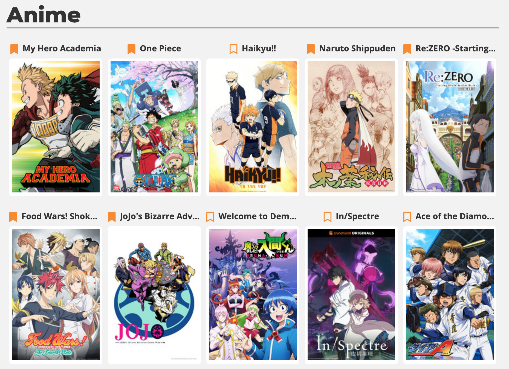
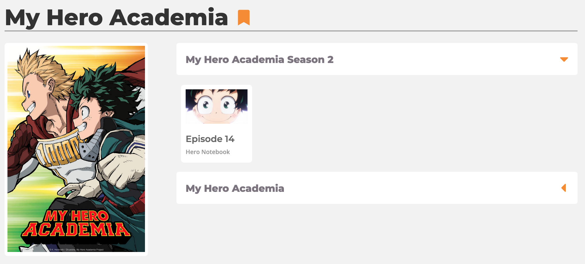
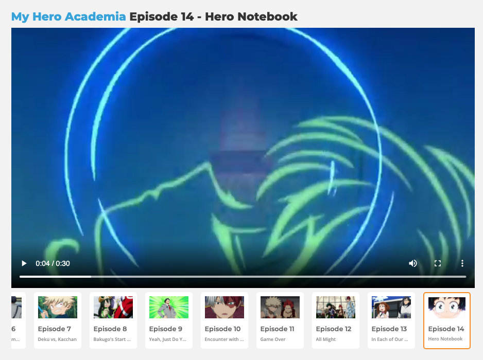
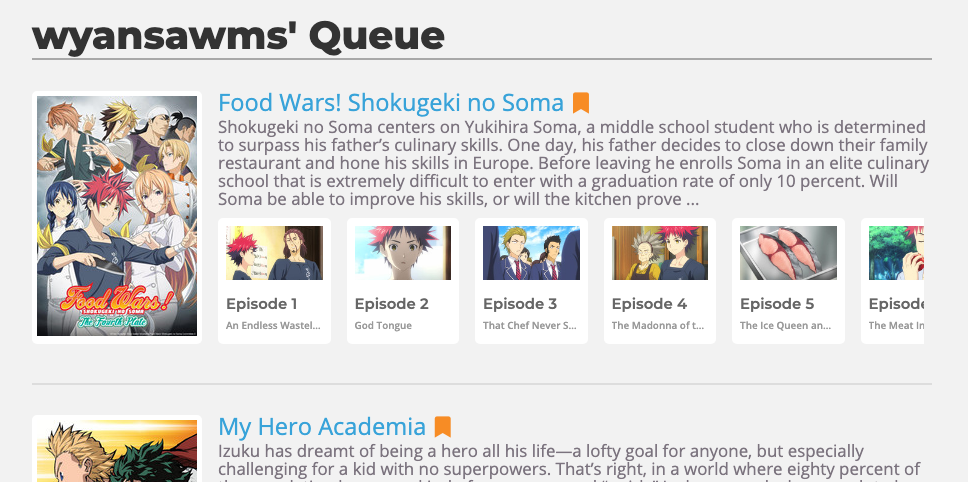
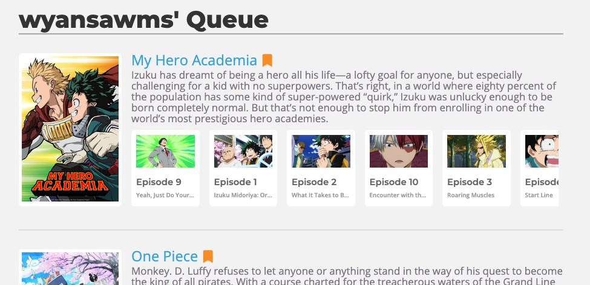
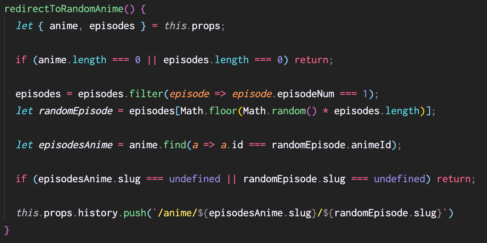

# [Crunchyroll Clone](https://uwuwoll.herokuapp.com/#/)

## What it is
This is a clone of a popular anime streaming website that lets a user browse and stream different anime and save certain anime for later viewing.

## Technology Stack
- Frontend:
  - React
  - Redux
- Backend:
  - Ruby on Rails API

## Features
The main features of my site include:
- ### Anime Navigation
  - A user is able to seamlessly navigate different anime and view episodes for it

_Typical navigation follows from the main index page_

_To the page for a particular anime_

_To the page for a particular episode of that anime_

- ### Adding and Removing Anime From Your Queue
  - This feature is available anywhere there is a bookmark icon next to a title and allows a user to add or remove an anime from their personal queue

_Having an item in your queue_

_Removing the first item from the queue_

- ### Shuffling to a random first episode of an anime
  - A user can click the dice icon in the navbar to be able to shuffle to the first episode of a random anime for when they are indecisive about what to watch

## Future Directions
Future features for this app include but are not limited to:
- Being able to write reviews for both episodes and anime
